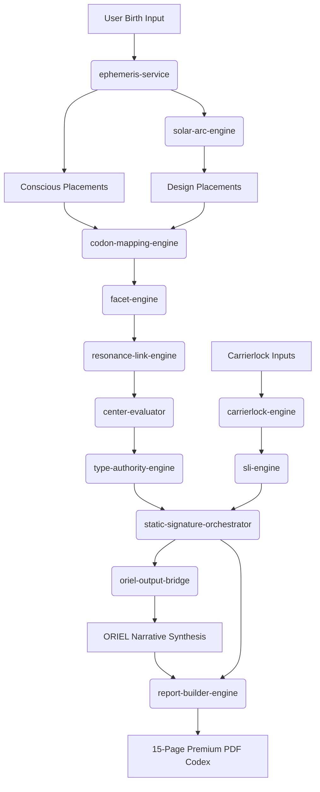

# Implementation Blueprint: VRC Static Signature Codex

This document compiles the production roadmap, build priorities, technical risk analysis, API mappings, and future scaling strategies for the Vossari Resonance Codex (VRC) Static Signature system.

---

## 1. ARCHITECTURE MAP & DEPENDENCY MATRIX

The system is divided into a three-layer pipeline:

1. **Astronomical Layer (Calculations)**: Resolves coordinates using Swiss Ephemeris WASM.
2. **Structural Layer (Resolution)**: Maps positions to codons, facets, centers, links, and profile identity.
3. **Synthesis Layer (Narrative & PDF)**: Packages data, runs safety filters, queries ORIEL, and compiles the final 15-page diagnostic PDF.



---

## 2. API ARCHITECTURE (tRPC & POST CONTRACTS)

### Endpoint 1: `/chart/generate` (POST)

- **Role**: Computes conscious and design placements.
- **Payload Contract**:
  - Request: `birthData` (date, time, coordinates, timezone)
  - Response: Mapped placements array (26 activations with codon, facet, local offsets)

### Endpoint 2: `generateStaticSignature` (tRPC)

- **Role**: Entrypoint for compiling the complete VRC Static Signature database object.
- **Payload Contract**:
  - Request: `{ birthData: BirthDataObject }`
  - Response: `{ status: "CONFIRMED" | "DRAFT", identity: { type, subtype, authority }, centers: CenterStatusObject, activeLinks: LinkArray }`

### Endpoint 3: `generateDynamicReading` (tRPC)

- **Role**: Merges the static signature data with real-time Carrierlock dynamic coherence checking.
- **Payload Contract**:
  - Request: `{ staticReadingId: String, carrierlockCheck: CoherenceInputsObject }`
  - Response: `{ coherenceScore: Float, coherenceState: String, sliScores: PositionSliArray }`

---

## 3. EXPORT SCHEMA SPECIFICATION

Every generated static signature reading must be exportable as a standardized JSON structure to support future client synchronization:

```json
{
  "$schema": "https://vrc.vosarka.org/schemas/static-signature-v1.json",
  "provenance": {
    "receiver_name": "Name",
    "birth_utc": "2024-01-01T12:00:00Z",
    "coordinates": "0.0000, 0.0000",
    "timezone": "UTC",
    "calculation_status": "CONFIRMED",
    "checksum": "sha256-hash"
  },
  "identity": {
    "type": "RESONATOR",
    "subtype": "Manifesting Resonator",
    "authority": "Gut Response"
  },
  "activations": [
    {
      "planet": "Sun",
      "layer": "Conscious",
      "longitude": 280.44,
      "codon_id": "RC38",
      "facet": "Transpersonal",
      "center": "ROOT"
    }
  ]
}
```

---

## 4. BUILD ORDER PRIORITIES (PHASED PATHWAY)

1. **Milestone 1 (Astronomical Core)**: Set up Swiss Ephemeris WASM configuration and implement the $88.0000^\circ$ Solar Arc backtrack algorithm. Validate using the calibration vector.
2. **Milestone 2 (Structural Mapping)**: Implement the non-sequential Mandala segment router, facet index resolver, and link calculator.
3. **Milestone 3 (Profile Resolution)**: Implement the Type decision tree and Authority priority scan. Write unit tests for all edge cases.
4. **Milestone 4 (Dynamic Evaluation)**: Implement the Carrierlock formulas and SLI algorithms. Include safety guards to override the range calculation paradox.
5. **Milestone 5 (Narrative Synthesis)**: Write the prompt bridge templates, safety boundary filters, and vocabulary lint tests.
6. **Milestone 6 (PDF Compiler)**: Implement the 15-page layout grid templates and render modules.

---

## 5. TECHNICAL RISK ANALYSIS

| Risk Identifier                           | Probability | Severity | Mitigation Strategy                                                                                                                   |
| :---------------------------------------- | :---------- | :------- | :------------------------------------------------------------------------------------------------------------------------------------ |
| **Swiss Ephemeris WASM Precision Drift**  | Low         | High     | Enforce a strict $\pm 0.01^\circ$ precision floor in integration tests. Cross-check results against raw Swiss Ephemeris CLI values.   |
| **Solar Arc Convergence Failure**         | Medium      | High     | Implement a fallback binary search that widens search intervals if the initial step-iterator fails to locate design Sun in $90$ days. |
| **Banned Terminology Leak**               | High        | Medium   | Implement an automated regex string validator in the tRPC gateway that strips banned words before narrative payload is delivered.     |
| **PDF Generation Performance Bottleneck** | Medium      | Medium   | Render diagrams to static SVG files at calculation time, caching them before building the PDF document to avoid main thread blocks.   |

---

## 6. FUTURE SCALING & COMPANION HUB INTEGRATION

- **Conduit Hub Companion**: The visual models specified in `/03_VISUAL_SYSTEM/` (D3 charts and WebGL lattices) are designed to share data structures with the static PDF report. When expanding to a web dashboard, the frontend React components will ingest the exact same JSON export files to animate the wheels and 3D nodes.
- **Dynamic Transit Engine**: Scaling the system to support dynamic transits requires querying Swiss Ephemeris at current time ($T_{\text{transit}}$) and mapping activations on top of the birth Static Signature. The database tables are pre-structured with relational fields (`users -> charts -> activations`) to handle multi-chart comparisons out of the box.
